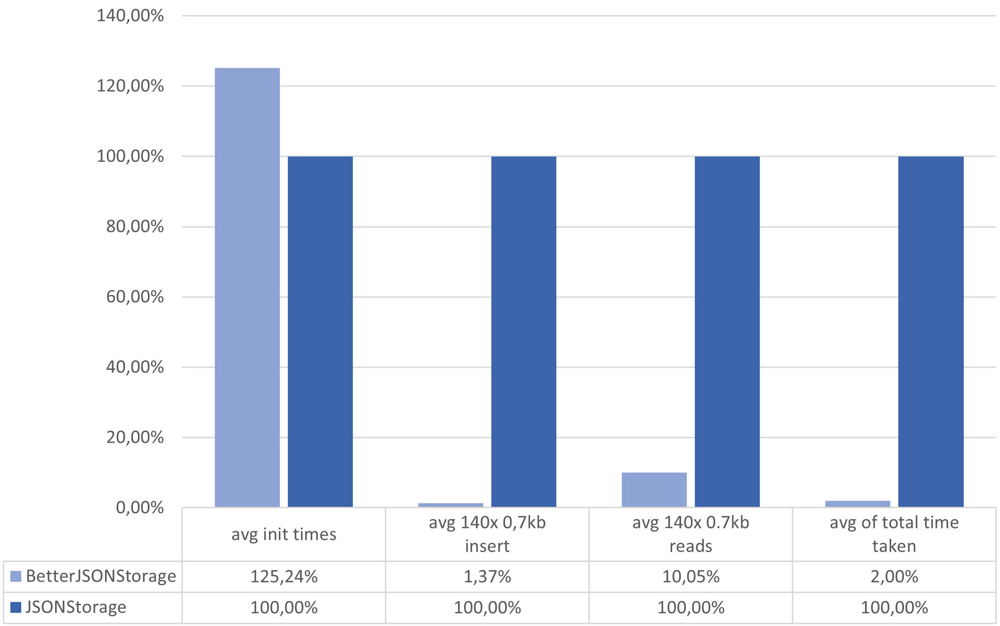

.. image:: https://raw.githubusercontent.com/MrPigss/BetterJSONStorage/master/img/logo.png
    :scale: 100%
    :height: 150px

Introduction
************

.. image:: https://codecov.io/gh/MrPigss/BetterJSONStorage/branch/master/graph/badge.svg?token=JN69A9GD3D
    :target: https://codecov.io/gh/MrPigss/BetterJSONStorage
.. image:: https://img.shields.io/badge/code%20style-black-000000.svg
    :target: https://github.com/psf/black
.. image:: https://badge.fury.io/py/BetterJSONStorage.svg
    :target: https://badge.fury.io/py/BetterJSONStorage

BetterJSONStorage is a faster 'Storage Type' for TinyDB_.
It uses the faster Orjson_ library for parsing the JSON and BLOSC2_ for compression.

Parsing, compressing, and writing to the file is done by a seperate thread so reads don't get blocked by slow fileIO.
Smaller filesizes result in faster reading and writing (less diskIO).
Even Reading is all done from memory.

These optimizations result in much faster reading and writing without loss of functionality.

A goal for the BetterJSONStorage project is to provide a drop in replacement for the default JSONStorage.

An example of how to implement BetterJSONStorage can be found below.
Anything else can be found in the `TinyDB docs <https://tinydb.readthedocs.io/>`_.

Installing BetterJSONStorage
****************************

Install BetterJSONStorage from `PyPi <https://pypi.org/project/BetterJSONStorage/>`_.

.. code-block:: PowerShell

    pip install BetterJSONStorage

Usage
************

context Manager
===============
.. code-block:: python

    from pathlib import Path
    from tinydb import TinyDB
    from BetterJSONStorage import BetterJSONStorage

    path = Path('relative/path/to/file.db')

    with TinyDB(path, access_mode="r+", storage=BetterJSONStorage) as db:
        db.insert({'int': 1, 'char': 'a'})
        db.insert({'int': 1, 'char': 'b'})

.. _TinyDB: https://github.com/msiemens/tinydb
.. _Orjson: https://github.com/ijl/orjson
.. _BLOSC2: https://github.com/Blosc/python-blosc2

extra
=====
one difference from TinyDB default JSONStorage is that BetterJSONStorage is ReadOnly by default.
use access_mode='r+' if you want to write as well.

All arguments except for the storage and access_mode argument are forwarded to the underlying storage.
You can use this to pass additional keyword arguments to orjson.dumps(…) method.

For all options see the `orjson documentation <https://github.com/ijl/orjson#option>`_.

.. code-block:: python

    with TinyDB('file.db', option=orjson.OPT_NAIVE_UTC, storage=BetterJSONStorage) as db:

performance
************
The benchmarks are done on fixtures of real data:

* citm_catalog.json, 1.7MiB, concert data, containing nested dictionaries of strings and arrays of integers, indented.
* canada.json, 2.2MiB, coordinates of the Canadian border in GeoJSON format, containing floats and arrays, indented.
* twitter.json, 631.5KiB, results of a search on Twitter for "一", containing CJK strings, dictionaries of strings and arrays of dictionaries, indented.

data can be found `here <https://github.com/serde-rs/json-benchmark/tree/master/data>`_.

The exact same code is used for both BetterJSONStorage and the default JSONStorage.
BetterJSONStorage is faster in almost* all situations and uses significantly less space on disk.

citm_catalog.json
==================

.. list-table:: storage used
   :widths: 25 25 25
   :header-rows: 1

   * - storage
     - used storage in kb
     - vs. BetterJSONStorage
   * - BetterJSONStorage
     - 83.3
     - 1x
   * - default JSONStorage
     - 540
     - 6.48x

canada.json
==================

.. list-table:: storage used
   :widths: 25 25 25
   :header-rows: 1

   * - storage
     - used storage in kb
     - vs. BetterJSONStorage
   * - BetterJSONStorage
     - 1572
     - 1x
   * - default JSONStorage
     - 2150
     - 1.36x

twitter.json
==================

.. list-table:: storage used
   :widths: 25 25 25
   :header-rows: 1

   * - storage
     - used storage in kb
     - vs. BetterJSONStorage
   * - BetterJSONStorage
     - 155
     - 1x
   * - default JSONStorage
     - 574
     - 3.7x

Random generated JSON
=====================

JSON has been generated on `json-generator <https://app.json-generator.com/6R7FY2v7Bqvc>`_.
The generated JSON contains 140 items of about 0.7kb each. (100kb total)
Every test was run 10 times and the average was taken.

init times: the time it takes to instantiate the db and storage:
 | BetterJSONStorage takes a bit more time to start but this only has to happen once in the beginning.
 | This was a tradeoff that made it possible for the fast reads and writes we see from BetterJSONStorage.

.. list-table:: avg init times
   :widths: 25 25
   :header-rows: 1

   * - storage
     - time taken in μs
   * - BetterJSONStorage
     - 181884
   * - default JSONStorage
     - 145234

insert time: the time it took to insert 140 items of around 0.7kb each:
 | Because BetterJSONStorage uses a seperate thread for writing, the main thread is not blocked.
 | This means no waiting for fileIO between subsequent writes.
 | BetterJSONStorage makes sure every thing is writen correctly.

.. list-table:: avg 140x 0,7kb insert
   :widths: 25 25
   :header-rows: 1

   * - storage
     - time taken in μs
   * - BetterJSONStorage
     - 41448
   * - default JSONStorage
     - 3019673

read times: the time it took to read 140 items of around 0.7kb each:
 | All reading is done from memory and not from disk.
 | This means working with very large files can be an issue,
 | but if you're working on extremely large datasets TinyDB might also not be the right solution for you.
 | This also means reading is extremely fast.
 | Data in memory and on disk is always synced in the background so there should be no slowdown even with heavy writing in between reads.

.. list-table:: avg 140x 0.7kb reads
   :widths: 25 25
   :header-rows: 1

   * - storage
     - time taken in μs
   * - BetterJSONStorage
     - 1314
   * - default JSONStorage
     - 13075

Graph
=====

This is the same data that has een used above poured into a nice excel graph.

